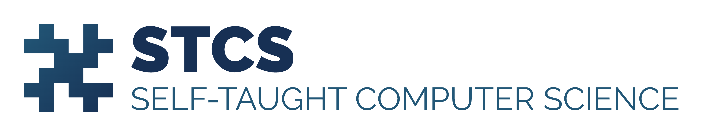

<h3>Self-Taught Computer Science</h3>

  My journey to a free self-taught education in Computer Science!

# Contents

- [My Progress as of Today](#my-progress-as-of-today)
- [Motivation](#motivation)
- [Why STCS](#why-stcs)
- [Summary](#summary)
- [Curriculum](#curriculum)
- [Acknowledgments](#acknowledgments)

# Motivation

### Bit of Background

I am a drop-out student from DVM (Doctor of Veterinary Medicine). After studying DVM for 3.5 years, I decided to switch my career-path altogether and study computer science. For that, I had to immigrate so I moved to Canada and studied a 2-year program in a college from which I graduated on April 2024.

I was a straight A student, My GPA was 4.18/4.33 and most of the courses I got less than A+ were non-CS courses. I definitely learned a lot as someone who had no idea about programming and transformed to someone who was recognized and admired for being a smart and talented programmer both by my peers and teachers.

However, as flattered and happy as I am about this outcome, I have not achieved the goal that I wanted. #TODO

### Why you don't just go and apply to a university in Canada or US and get a bachelor?

That was my plan and I would have done it in the first place, or by now, if I had enough money to support myself. but I don't. It cost roughly $27,000 to $37,000 USD to study bachelor of CS at a university in BC, Canada. For International students, there isn't much scholarship opportunities available to cover a significant portion of that amount.

US has the upper hand with more universities and more scholarship opportunities available. They offer a full coverage for your tuition fee if you are the student they want, but they only accept international students starting in fall (MIT, Stanford, CalTech and so on).

As I am writing this, It is May 4, 2024 and I don't want to just wait until next fall for the possibility of getting into one of those programs. But when the time comes, I might consider them and apply.

# Why STCS?

I felt the need for the knowledge that an undergrad has access to and studies. So I started with <a href="https://github.com/ossu" alt="Link to Open Source Society University GitHub" target="_">Open Source Society University (OSSU)</a> to learn the equivalent. They offer a free curriculum for people who want to learn computer science on their own through online materials (usually recorded by universities like MIT, Stanford, Harvard, UBC and so on). But I don't want to just blindly follow that I would like to add my own touch to it and bend it to suit my own needs (an important quality of a good education).

Moreover, as I attended more events and met other developers and peers in the industry, I came to believe that learning in a field like CS never ends and that is a good thing! There will be new trends, new technologies and in turn, business ideas and demands that need to be met with those technologies. To my knowledge, CS is finding its place in many different disciplines and fields; We have tech stacks that are tailored to a specific industry. It is changing and advancing every minute!

So I decided to start a project and self-study myself. In the short-term, my goal is to learn the equivalent of bachelor of CS based on <a href="https://github.com/ossu/computer-science" alt="Link to Open Source Society University Computer Science Curriculum" target="_">OSSU curriculum</a> (But I won't strictly follow that). In the long-term, I will be documenting my own learning and development effort here. I am hoping that others might find it inspiring and helpful. hopefully, This repo can become a guide for people who want to do something similar.

# Curriculum

- Intro CS
  - [Introduction to programming](course-pages/intro-programming/README.md)
  - [Introduction to Computer Science](course-pages/intro-cs/README.md)
- Core CS
  - Core programming
    - [Systematic Program Design 1](course-pages/core-cs/systematic-program-design/README.md)
    - [Systematic Program Design 2](course-pages/core-cs/systematic-program-design/README.md)
  - Core math
  - CS Tools
  - Core systems
  - Core theory
  - Core security
  - Core applications
  - Core ethics
- Advanced CS
  - Advanced programming
  - Advanced systems
  - Advanced theory
  - Advanced information security
  - Advanced math
- Final project

<table>
  <thead>
    <tr>
      <th>Category</th>
      <th>Subcategory</th>
      <th>Course</th>
    </tr>
  </thead>
  <tbody>
    <tr>
      <td rowspan="6">☐ Intro CS </td>
      <td rowspan="3">☐ Introduction to programming</td>
    </tr>
    <tr>
      <td>
        ☐ <a href="/course-pages/intro-programming/README.md" style="text-decoration: none;">CS50 - Harvard
        </a>
      </td>
    </tr>
    <tr>
      <td>
        ☐ <a href="/course-pages/intro-programming/README.md" style="text-decoration: none;">Python for Everybody - UMich
        </a>
      </td>
    </tr>
    <tr>
      <td rowspan="3">☐ Introduction to Computer Science</td>
    </tr>
    <tr>
      <td>
        ☐ <a href="/course-pages/intro-cs/README.md" style="text-decoration: none;">6.00.1x - MIT
        </a>
      </td>
    </tr>
    <tr>
      <td>
        ☐ <a href="/course-pages/intro-cs/README.md" style="text-decoration: none;">6.00.2x - MIT
        </a>
      </td>
    </tr>
    <tr>
      <td rowspan="14">☐ Core CS</td>
      <td rowspan="7">☐ Core programming</td>
    </tr>
    <tr>
      <td>
        ☐ <a href="/course-pages/core-cs/systematic-program-design/README.md" style="text-decoration: none;">Systematic Program Design</a>
      </td>
    </tr>
    <tr>
      <td>Course 3</td>
    </tr>
    <tr>
      <td>Course 4</td>
    </tr>
    <tr>
      <td>Course 5</td>
    </tr>
    <tr>
      <td>Course 6</td>
    </tr>
    <tr>
      <td>Course 7</td>
    </tr>
    <tr>
      <td>Core math</td>
    </tr>
    <tr>
      <td>CS Tools</td>
    </tr>
    <tr>
      <td>Core systems</td>
    </tr>
    <tr>
      <td>Core theory</td>
    </tr>
    <tr>
      <td>Core security</td>
    </tr>
    <tr>
      <td>Core applications</td>
    </tr>
    <tr>
      <td>Core ethics</td>
    </tr>
    <tr>
      <td rowspan="5">Advanced CS</td>
      <td>Advanced programming</td>
    </tr>
    <tr>
      <td>Advanced systems</td>
    </tr>
    <tr>
      <td>Advanced theory</td>
    </tr>
    <tr>
      <td>Advanced information security</td>
    </tr>
    <tr>
      <td>Advanced math</td>
    </tr>
    <tr>
      <td>Final project</td>
    </tr>
  </tbody>
</table>
`
